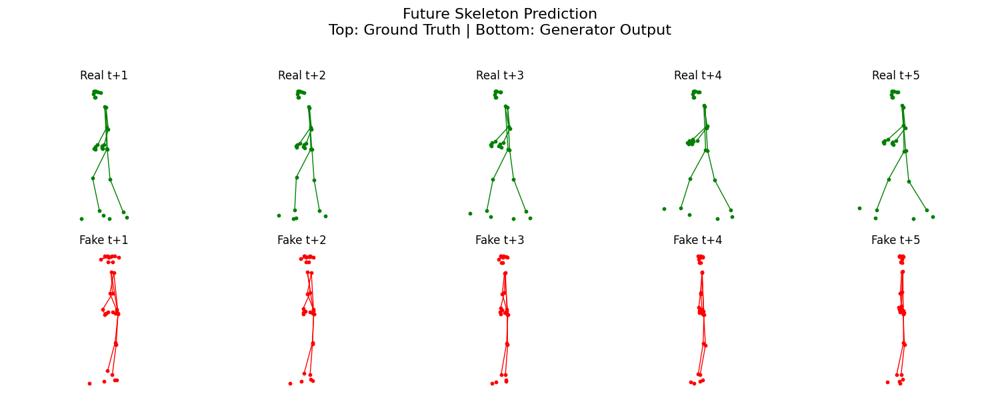

```markdown
# 🦴 GenAI Skeleton Prediction

This project implements a Generative Adversarial Network (GAN) using LSTM layers to predict future human poses based on past motion sequences. The model works with 3D skeletal keypoints and aims to generate realistic future body movements.


```
### 


📁 GenAI\_skeleton\_prediction/

├── generator\_lstm1.pth          ← Trained Generator model (tracked with Git LFS)

├── discriminator\_lstm1.pth      ← Trained Discriminator model (tracked with Git LFS)

├── X\_pose\_train.npy             ← Input sequences (past T frames)

├── Y\_pose\_train.npy             ← Ground truth sequences (future M frames)

├── lstm\_gan2.py                 ← GAN training script


├── metric\_calculation.py          ← Evaluation metrics (MAE, MSE, RMSE, etc.)

└── README.md                    ← Project documentation


````

---

## 🧠 Model Architecture

### Generator
- Projects 3D keypoints per frame into 512D
- 2-layer LSTM to learn temporal patterns
- Fully connected layers generate M future frames

### Discriminator
- Projects 3D keypoints similarly
- 2-layer LSTM followed by dense layers
- Predicts if the future sequence is real or fake

---

## 📊 Evaluation Results

Using Euclidean distances from a central reference point:

| Metric | Value     |
|--------|-----------|
| MAE    | 6.9909    |
| MSE    | 109.6542  |
| RMSE   | 10.4716   |

> 📌 Lower values indicate better model performance.  
> These scores suggest the model captures rough pose structure but still has room for improvement.

---

## 📈 Visualization

Each row contains 5 future frames:

- **Top Row**: Ground Truth (green)
- **Bottom Row**: Generator Prediction (red)

Skeletons use MediaPipe's 33 keypoint format.

### 🔍 Sample Output



---
---

## ⚙️ How to Run

### 1. Install Dependencies

```bash
pip install torch numpy matplotlib scikit-learn git-lfs
````

### 2. Setup Git LFS

```bash
git lfs install
```

### 3. Clone the Repository

```bash
git clone https://github.com/Amish-03/GenAi_skeleton_prediction.git
cd GenAi_skeleton_prediction
```

### 4. Train the Model

```bash
python train_gan.py
```

### 5. Evaluate the Model

```bash
python evaluate_metrics.py
```

### 6. Visualize Predictions

```bash
python visualize.py
```

---

## 🔍 Data Format

* `X_pose_train.npy`: Shape `[N, T, 33, 3]`
* `Y_pose_train.npy`: Shape `[N, M, 33, 3]`
  Each keypoint has `(x, y, z)` format. T = 10, M = 5

---

## 🙋 Author

**Amish**
🎓 B.E. in Electronics and Communication Engineering
🎸 Guitarist | 🧠 AI Enthusiast
📍 KLE Technological University

---

## 🚀 Future Improvements

* Real-time pose prediction via webcam input
* Use Transformer architectures for long-term motion modeling
* Add skeletal velocity & acceleration as additional features

---

## 🧾 Notes

* `.pth` files must be tracked with Git LFS due to size limits
* Skeleton format follows MediaPipe Pose (33 keypoints)
* Trained on synthetic or motion capture-like datasets

---

Thank you for checking out this project! 🌟

```

Let me know if you want a short version or extras like GitHub badges or demo GIFs.
```
